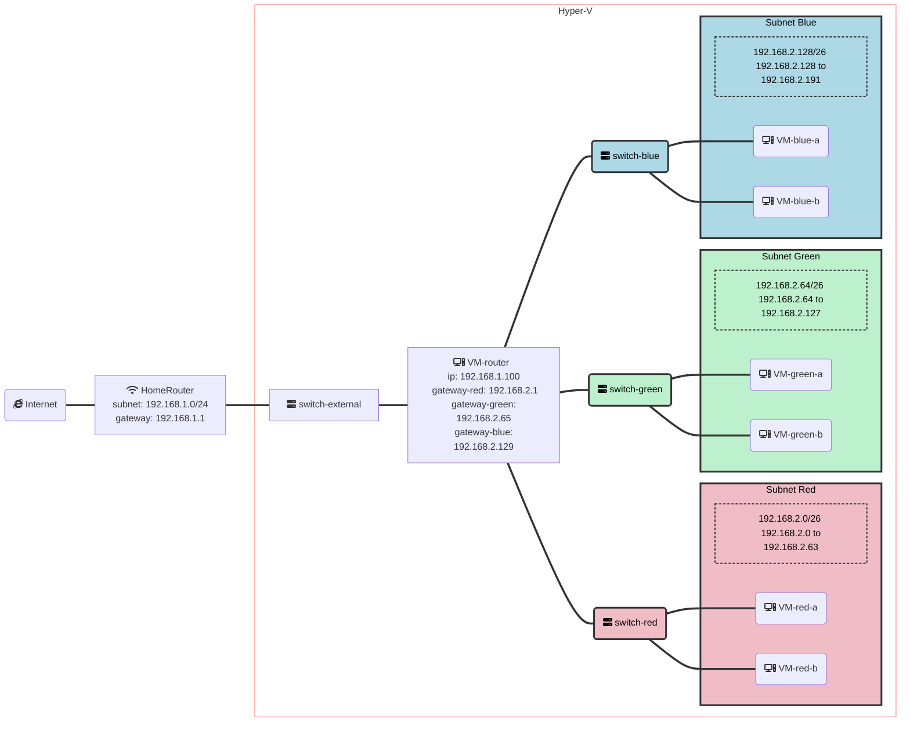

# Welcome

---

### Networking Diagram

```mermaid
graph LR
    Internet(fab:fa-internet-explorer Internet) === HomeRouter[fa:fa-wifi HomeRouter </br> subnet: 192.168.1.0/24 </br> gateway: 192.168.1.1]
    HomeRouter === externalSwitch[fa:fa-server switch-external]
    hyper-V:::whiteClass
    classDef whiteClass fill:#0000,stroke:#f66,stroke-width:1px
    subgraph hyper-V["Hyper-V"]
        externalSwitch === VMrouter[fa:fa-computer VM-router  </br> ip: 192.168.1.100 </br> gateway-red: 192.168.2.1</br> gateway-green: 192.168.2.65</br> gateway-blue: 192.168.2.129 ]
        VMrouter === Switch-green:::greenClass
        VMrouter === Switch-red:::redClass
        VMrouter === Switch-blue:::blueClass
        classDef greenClass fill:#bdf0cc,stroke:#333,stroke-width:3px, color: black;
        classDef greenClassDashed fill:#bdf0cc,stroke:#333,stroke-width:2px, stroke-dasharray: 4 3, color: black;
        classDef redClass  fill:#f0bdc7,stroke:#333,stroke-width:3px, color: black;
        classDef redClassDashed  fill:#f0bdc7,stroke:#333,stroke-width:2px, stroke-dasharray: 4 3, color: black;
        classDef blueClass  fill:lightblue,stroke:#333,stroke-width:3px, color: black;
        classDef blueClassDashed  fill:lightblue,stroke:#333,stroke-width:2px, stroke-dasharray: 4 3, color: black;


        subnet-red:::redClass
        ipaddressrange-red:::redClassDashed
        subnet-green:::greenClass
        ipaddressrange-green:::greenClassDashed
        subnet-blue:::blueClass
        ipaddressrange-blue:::blueClassDashed
        Switch-red(fa:fa-server switch-red)
        Switch-red === VM-red-a
        Switch-red === VM-red-b

        subgraph subnet-red["Subnet Red"]
            direction LR
            VM-red-a(fa:fa-computer VM-red-a)
            ipaddressrange-red[192.168.2.0/26 </br > 192.168.2.0 to 192.168.2.63]
            VM-red-b(fa:fa-computer VM-red-b)
        end

        Switch-green(fa:fa-server switch-green)
        Switch-green === VM-green-a
        Switch-green === VM-green-b

        subgraph subnet-green["Subnet Green"]
            direction LR
            VM-green-a(fa:fa-computer VM-green-a)
            ipaddressrange-green[192.168.2.64/26 </br > 192.168.2.64 to 192.168.2.127]
            VM-green-b(fa:fa-computer VM-green-b)
        end

        Switch-blue(fa:fa-server switch-blue)
        Switch-blue === VM-blue-a
        Switch-blue === VM-blue-b
        subgraph subnet-blue["Subnet Blue"]
            direction LR
            VM-blue-a(fa:fa-computer VM-blue-a)
            ipaddressrange-blue[192.168.2.128/26 </br > 192.168.2.128 to 192.168.2.191]
            VM-blue-b(fa:fa-computer VM-blue-b)
        end
    end
```
