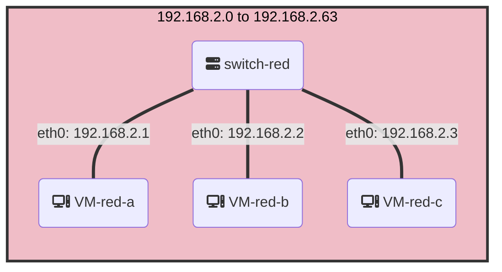

# ➡️ Local Networking
___

Communication between computers within a network is called local networking. 

Consider computers red-a, red-b and red-c connected to a switch in a subnet with the given IP address range.



When you connect two Windows computers with an Ethernet cable, they automatically assign themselves IP addresses in the 169.254.x.x range using the Automatic Private IP Addressing (APIPA) feature.

Whether using a switch or now, the computers are able to communicate with each other. Ubuntu, like Windows, supports Automatic Private IP Addressing (APIPA). 

In the case where an IP address is not auto-assigned, we can assign the IP address statically. 

### Ethernet Frames

An Ethernet frame is a unit of data transmitted over an Ethernet network, consisting of a header and payload, and is used to facilitate communication between network devices.

| EtherType | Layer | Description |
|-----------|-------|-------------|
| 0x0806    | Layer 2 | ARP is used to map a network address (such as an IP address) to a physical address (such as a MAC address) at the link layer. |
| 0x888e    | Layer 2 | EAPOL is used for network authentication and is typically used with wireless networks to provide secure access. |
| 0x0800    | Layer 3 | IPv4 is the most commonly used protocol for internet traffic and is used to route data packets across networks and the internet. |
| 0x86dd    | Layer 3 | IPv6 is the next-generation internet protocol that provides a larger address space and improved routing functionality. |
| 0x88cc    | Layer 2 | LLDP is used to exchange information about network devices and their capabilities at the link layer. It is often used in conjunction with network management protocols such as SNMP. | 

When computers communicate over a network, we can use a tool to intercept these ethernet frames.

If we use `tcpdump` to trace packets, we can see each packet in this format

```shell-session
16:40:33.569449 00:15:5d:be:f1:3a > 01:00:5e:7f:ff:fa, ethertype IPv4 (0x0800), length 217: 172.26.64.1.59431 > 239.255.255.250.1900: UDP, length 175
```

It means

- `16:40:33.569449`: This is the timestamp for when the packet was captured.

- `00:15:5d:be:f1:3a`: This is the source MAC address of the Ethernet frame.

- `01:00:5e:7f:ff:fa`: This is the destination MAC address of the Ethernet frame. In this case, it is a multicast address.

- `ethertype IPv4 (0x0800)`: This is the EtherType field of the Ethernet frame, which indicates that the payload of the frame is an IPv4 packet.

- `length 217`: This is the length of the Ethernet frame, including the header and payload, in bytes.

- `172.26.64.1.59431`: This is the source IP address and port number of the IPv4 packet.

- `239.255.255.250.1900`: This is the destination IP address and port number of the IPv4 packet. In this case, it is a multicast address and the destination port number is 1900, which is used by the Simple Service Discovery Protocol (SSDP).

- `UDP, length 175`: This indicates that the payload of the IPv4 packet is a UDP packet with a length of 175 bytes. UDP is a transport layer protocol that is used for communication between applications running on different hosts.

## EtherTypes in an ethernet frame

Here are some common EtherTypes:

| EtherType | Layer | Description |
|-----------|-------|-------------|
| 0x0806    | Layer 2 | ARP is used to map a network address (such as an IP address) to a physical address (such as a MAC address) at the link layer. |
| 0x888e    | Layer 2 | EAPOL is used for network authentication and is typically used with wireless networks to provide secure access. |
| 0x0800    | Layer 3 | IPv4 is the most commonly used protocol for internet traffic and is used to route data packets across networks and the internet. |
| 0x86dd    | Layer 3 | IPv6 is the next-generation internet protocol that provides a larger address space and improved routing functionality. |
| 0x88cc    | Layer 2 | LLDP is used to exchange information about network devices and their capabilities at the link layer. It is often used in conjunction with network management protocols such as SNMP. | 

# ARP

---
ARP (Address Resolution Protocol) is a protocol used to map a network address (such as an IP address) to a physical address (such as a MAC address) at the link layer.

Your computer associates IP addresses on the network with their corresponding MAC addresses in an ARP cache. To avoid sending an ARP request every time it needs to communicate with a device, your computer keeps a cache of recently seen MAC addresses and their corresponding IP addresses.

You can run this command to see the ARP cache entries on your computer. Mac addresses that are known to each individual computer and which IP they are associated to on the local network.

```bash
arp -a
```

Here's an example of an ARP request and response between a host with IP address `192.168.1.2` and a client with IP address `192.168.1.3`.

Example ARP Request (`tcpdump`):

```
17:26:32.218132 00:15:5d:5e:5c:01 > ff:ff:ff:ff:ff:ff, ethertype ARP (0x0806), length 58: Request who-has 192.168.1.3 tell 192.168.1.2, length 44

```

Example ARP Response (`tcpdump`):
```
17:30:47.547077 00:15:5d:be:f1:3a > 00:15:5d:5e:5c:01, ethertype ARP (0x0806), length 42: Reply 192.168.1.3 is-at AA:BB:CC:DD:EE:FF, length 28
```

:::tip
Takeaway: In local network communication, both the IP and MAC addresses are required because payload packets need to be encapsulated within Ethernet frames for transmission over the local network, and the Ethernet frame header includes the source and destination MAC addresses. ARP is used to map IP addresses to MAC addresses by broadcasting an ARP request to all devices on the network and waiting for the device with the specified IP address to respond with its MAC address.
:::