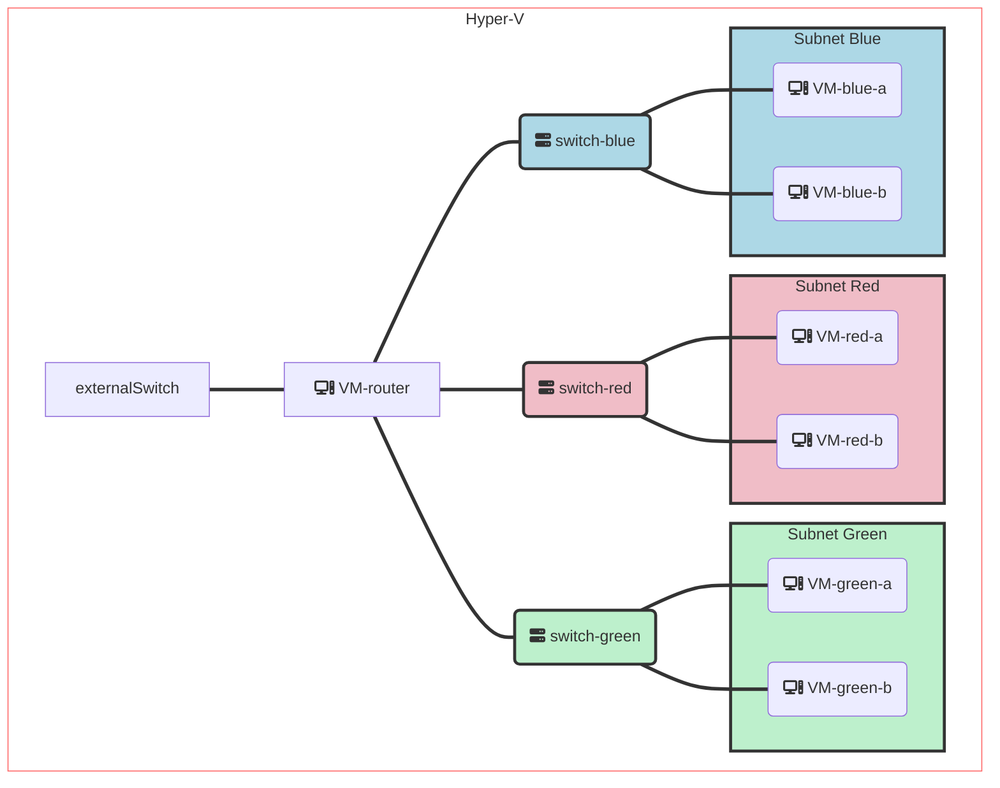

# Progress

In this exercise you'll be pretending to be a network admin and will need setup some very typical network configurations from scratch. You'll have to deal with failures on every 2nd step and through troubleshooting of those failures you learn all the fundamentals.

You should do that sequentially (order is intentionally chosen) and can choose to stop any time without feeling bad about it - most people actually don't go to Anycast/BGP parts

As you do things I advise to capture some key learnings, conclusions or even snippets of concrete commands right in this document using different font or color, as you do things. Try to keep it compressed. You'll realize that this will be a useful document for you to return later at some point for hints or instructions on how to do something.

Prerequisite: set up Hyper-V

### Step 1: Create the switches

- [x] Create 3 private virtual switches called `red`, `green`, `blue`
- [x] Create a switch called `external` that public and connect it your home network

### Step 2: Create the VMs

- [x] Create 6 VMs   {red,green,blue}-{a,b}   [e.g.  `red-a`, `red-b`, `green-a`,….] and connect them to the appropriate switches.
	* Use UI-less (server) ubuntu SKU  (choose last LTS) 
	*  without DHCP
	* Verify that they indeed **fail** to acquire IP address, as there’s no DHCP

- [x] Create 1 VM called `router` and connect it all the switches
	* Verify that the router gets an IP address can access the internet

### Setup so far

