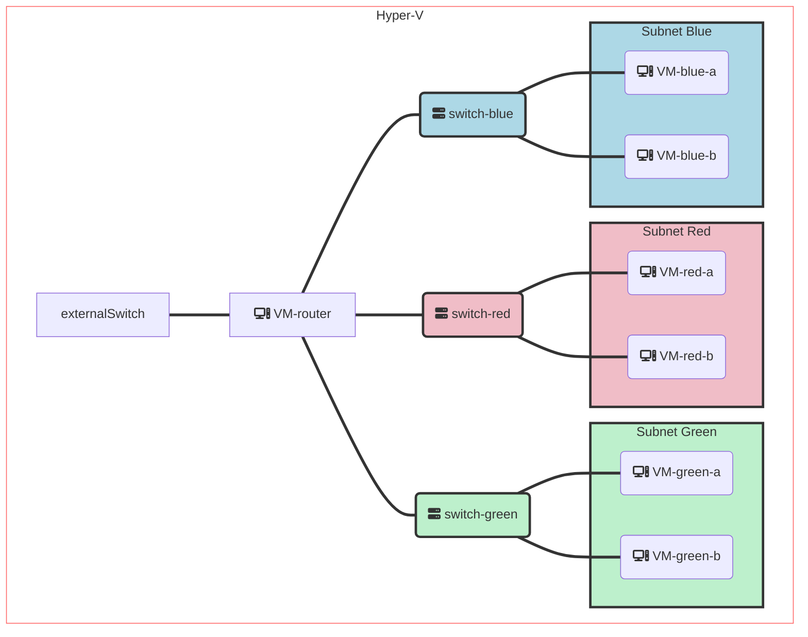

# Progress

In this exercise you'll be pretending to be a network admin and will need setup some very typical network configurations from scratch. You'll have to deal with failures on every 2nd step and through troubleshooting of those failures you learn all the fundamentals.

You should do that sequentially (order is intentionally chosen) and can choose to stop any time without feeling bad about it - most people actually don't go to Anycast/BGP parts

As you do things I advise to capture some key learnings, conclusions or even snippets of concrete commands right in this document using different font or color, as you do things. Try to keep it compressed. You'll realize that this will be a useful document for you to return later at some point for hints or instructions on how to do something.

Prerequisite: set up Hyper-V

### Create the switches

- [x] Create 3 private virtual switches called `red`, `green`, `blue`
- [x] Create a switch called `external` that public and connect it your home network

### Create the VMs

- [x] Create 6 VMs {red,green,blue}-{a,b} [e.g. `red-a`, `red-b`, `green-a`,….] and connect them to the appropriate switches.

  - Use UI-less (server) ubuntu SKU  (choose last LTS)
  - without DHCP
  - Verify that they indeed **fail** to acquire IP address, as there’s no DHCP

- [x] Create 1 VM called `router` and connect it all the switches
  - Verify that the router gets an IP address can access the internet
    - `ping google.com`
    - `ip addr show`

### Setup so far



## Commands

# ip commmand

## Basics

```
ip addr show

5: eth3: <BROADCAST,MULTICAST> mtu 1500 qdisc noop state DOWN group default qlen 1000
    link/ether 00:15:5d:01:0b:12 brd ff:ff:ff:ff:ff:ff
```

- `eth3`: This is the name of the network interface.
- `<BROADCAST,MULTICAST>`: These are the flags that indicate the capabilities and status of the interface. BROADCAST means that the interface can send and receive broadcast packets, which are packets that are addressed to all hosts on a network segment. MULTICAST means that the interface can send and receive multicast packets, which are packets that are addressed to a group of hosts that share a common interest.
- `mtu 1500`: This is the maximum transmission unit (MTU) of the interface, which is the maximum size of a packet that can be sent or received by the interface without fragmentation. The default value for Ethernet interfaces is 1500 bytes.
- `qdisc noop`: This is the queuing discipline (qdisc) of the interface, which is a mechanism that controls how packets are queued and dequeued for transmission or reception. The noop qdisc means that there is no queuing discipline applied, and packets are sent or received as soon as possible.
- `state DOWN`: This is the state of the interface, which indicates whether it is active or not. The DOWN state means that the interface is not active, either because it has no carrier signal (such as a cable unplugged) or because it has been manually disabled by an administrator. To change the state of an interface, you can use ip link set up or ip link set down commands
- `group default`: This is the group name of the interface, which allows you to assign multiple interfaces to a single group for easier management. The default group name means that no specific group has been assigned to this interface. You can change the group name of an interface using ip link set group command
- `qlen 1000`: This is the transmit queue length (txqueuelen) of the interface, which is how many packets can be queued for transmission before they are dropped by the kernel. The default value for Ethernet interfaces is 1000 packets.
- `link/ether 00:15:5d:01:0b:12 brd ff:ff:ff:ff:ff:ff`: MAC address (media access control address) of the Ethernet device. The **brd** part stands for broadcast, and shows the broadcast address ff:ff:ff:ff:ff: ff in hexadecimal notation. A broadcast address is used to send a packet to all devices on a network segment.

## For each VM ensure that the state is UP

## How to turn on state UP (not persistent after reboot)

```
sudo ip link set up dev eth3
```

## How to turn on state UP (persistent after reboot) Ubuntu Server 22.10

```
# Edit the configuration file, this is also how you can assign a static ip address

sudo vim /etc/netplan/00-installer-config.yaml

```

## How to check the DHCP leases of each interface

```
agontcharov@router:~$ netplan ip leases eth0
# This is private data. Do not parse.
ADDRESS=192.168.1.18
NETMASK=255.255.255.0
ROUTER=192.168.1.1
SERVER_ADDRESS=192.168.1.1
T1=43200
T2=75600
LIFETIME=86400
DNS=192.168.1.1
CLIENTID=<----------------------->
```

## Set up DHCP
